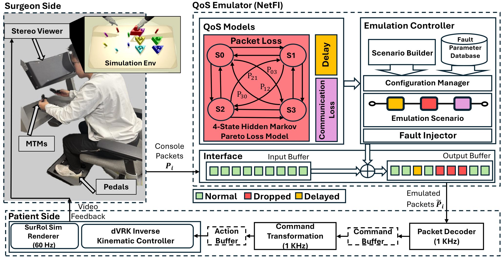
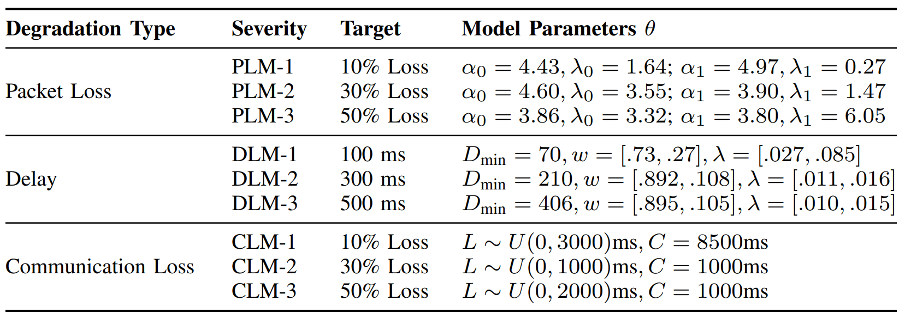

## A Comprehensive Analysis of the Effects of Network Quality of Service on Robotic Telesurgery

Code repository: **A Comprehensive Analysis of the Effects of Network Quality of Service on Robotic Telesurgery**, ICRA 2026

<p align="center">
  🌐 <a href="">Project</a>
  · 📄 <a href="">Paper</a>
  · 🤗 <a href="">Dataset</a>
</p>

### Overall Stucture of the Work

1. We introduce a novel model-based **Network Fault Injection tool (NetFI)** that emulates the effect of communication loss, packet loss, and delay based on realistic models and data from 4G/5G networks, that can be easily integrated into any teleoperation system to simulate diverse network QoS conditions by modifying the stochastic models and their parameters.
2. We conduct **a comprehensive user study involving 15 participants** at three proficiency levels, performing a standard Fundamentals of Laparoscopic Surgery (FLS) Peg Transfer task under different network conditions, using an open-source telesurgical simulation system which integrates a state-of-the-art surgical robot simulator (SurRoL) with a surgeon console (dVTrainer, Mimic Technologies) and mechanisms for real-time logging of kinematic, video, and foot pedal data for performance evaluation. This study resulted in a multimodal dataset with MP and error labels of 180 Peg Transfer trials. 

3. Providing **new insights into the effects of different QoS degradation scenarios** on user performance and operation safety, which covers both the task and MP levels, as well as different user proficiency levels and the user experience.

### Key parameters for emulated network degradations

The experiments involved performing the Peg Transfer task under **four primary network conditions**: **Normal** (no degradation), **Packet Loss**, **Delay**, and **Communication Loss**. For each of **the three degradation types**, participants were exposed to **three severity levels (low:1, medium:2, high:3)**. Packet loss, delay and communication loss are denoted as PLM, DLM and CLM, respectively. 

### How to run the code
#### Installation
The `Mantis_Client` folder contains the dVTrainer surgeon console code, which needs to be installed and run with the device.

For the simulation part, clone the `SurRoL_dVTrainer` and go into the folder
```
git clone https://github.com/UVA-DSA/teleoperation-simulator.git
cd teleoperation-simulator/SurRoL_dVTainer
```
Then follow instructions [SurRoL](https://github.com/med-air/SurRoL/tree/SurRoL-v2?tab=readme-ov-file) and [NetFI](https://github.com/UVA-DSA/NetFI) to setup the environment
#### Run Simulator with Emulated Network Condition
This teleoperation setup transmits ITP packets from the console/haptic device to the simulator via UDP. Ensure that a UDP socket connection is established and the correct **IP address and Port** are configured in `SurRoL_dVTrainer/test/dVTrainer/Console.py` and `Net.py`.

The network conditions load from `SurRoL_dVTrainer/test/dVTrainer/network_conditions.txt`. Each line represents one type of network condtion, for example:
```
"1 5G delay3 406 [0.89574, 0.10426] [0.01015, 0.01551]"
--"1": numbers of trial (every run this number is deducted by 1)
--"5G": one type of delay model
--"delay3": highest delay severity
--"406 [0.89574, 0.10426] [0.01015, 0.01551]": model parameters of highest delay severity
```

Run the script `random_experiment_new.py` to automatically update `network_conditions.txt` according to the user study design. 
```
cd SurRoL_dVTrainer/test/dVTrainer
python random_experiment_new.py
```

Once the network conditions are properly configured, launch the simulation:
```
cd SurRoL_dVTrainer/test
python test_multiple_scenes_console.py
```

Next, select `Basic Robot Skill Training Tasks` -> `Bi-Peg Transfer` in the interface and control the simulated robotic arm using the surgeon console.

Here is the demo video for our paper:

[](https://youtu.be/Dz9ssGQZePw)


## Citations
If you use this dataset in your work, please consider citing our paper:
<!-- ```bibtex
@misc{ge2025expertguidedpromptingretrievalaugmentedgeneration,
      title={Expert-Guided Prompting and Retrieval-Augmented Generation for Emergency Medical Service Question Answering}, 
      author={Xueren Ge and Sahil Murtaza and Anthony Cortez and Homa Alemzadeh},
      year={2025},
      eprint={2511.10900},
      archivePrefix={arXiv},
      primaryClass={cs.CL},
      url={https://arxiv.org/abs/2511.10900}, 
}
``` -->
